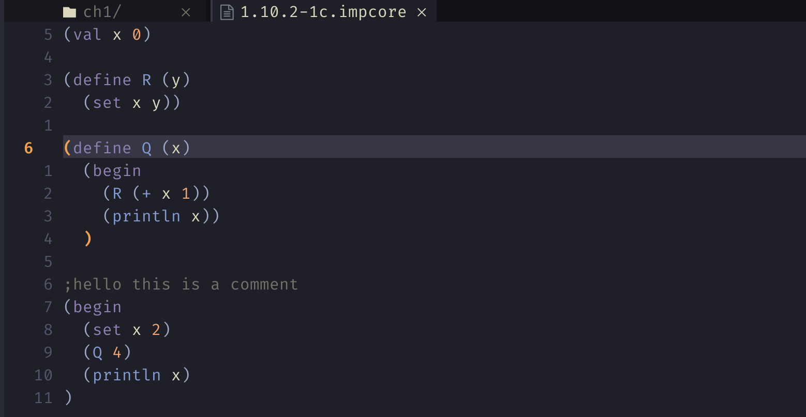

# tree-sitter-impcore

Tried my hand at writing up the impcore grammar for treesitter to get some syntax highlighting in neovim (using https://github.com/nvim-treesitter/nvim-treesitter)

### Installation

See https://github.com/nvim-treesitter/nvim-treesitter#adding-parsers

-----

